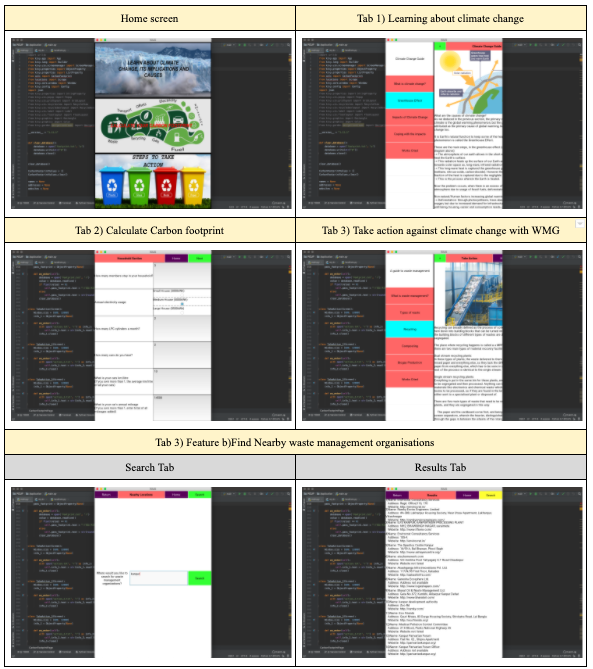

# Design10_PCUP
<h2 align='center'><strong>Waste Management App</strong></h2>

<em>Demo of application: <a href='https://www.youtube.com/watch?v=EQ9gxudWur8' target="_blank">Youtube Link</a></em>

This application allows it's users to:  
<ol type='1'>
  <li>Learn about waste management, how it leads to global warming in turn causing climate change</li>
  <li>Calculate Carbon Footprint to see how harmful the user is being to his/her environment</li>
  <li>Learn and get instruction on a variety of waste management techniques, to reduce the user's footprint</li>
</ol>
 
This application was made to satisfy the requriments of the Year 5 (Grade 10) Design course in the MYP (International Bacchelaurette), using these tools:
<ul type='square'>
  <li>Python module Kivy for the front end of application --> <a href='Application/main.py'>main.py</a> & <a href='Application/my.kv'>my.kv</a></li>
  <li>Python module Selenium & BeautifulSoup4 for scraping information from google maps upon search for nearby waste management organizations --> <a href='Application/locations.py'>locations.py</a></li>
  <li>Python math for calculating carbon footpring of users using inputs --> <a href='Application/calc.py'>calc.py</a></li>
</ul>
 
Screenshot of application working: 

  

